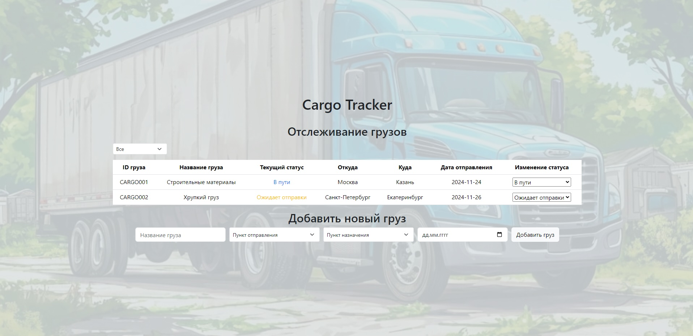

# Интерфейс для отслеживания грузов транспортной компании

## Информация о проекте

В этом проекте я создал интерфейс для отслеживания грузов транспортной компании
на базе React.js и TypeScript с использованием Bootstrap. 

<details>
<summary>Подробнее</summary>

Интерфейс позволяет:
1. Просматривать список грузов с текущим статусом.
2. Обновлять статус груза.
3. Добавлять новый груз для отслеживания.



</details>

## Инструкции по сборке и запуску

1. Склонировать себе этот репозиторий

```
git clone https://github.com/NikolaiGavrilov/Cargo-Tracking
```

2. Перейти в директорию

```
cd Cargo-Tracking
```

3. Выполнить команду ниже для установки необходимых node_modules

```
npm i
```

4. Запустить сервер разработки, выполнив в терминале команду

```
npm run dev
```

5. Перейти на сайт, кликнув по появившейся в окне терминала ссылке левой кнопкой
   мыши с зажатой клавишей Ctrl или скопировать следующую ссылку в адресную
   строку в браузере и самостоятельно выполнить переход.

```
http://localhost:5173/
```
